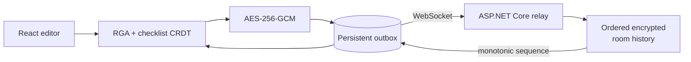

<div align="center">

# SyncLab

**An encrypted, local-first collaborative editor built to keep working when the network does not.**

[](https://github.com/EesherJ39/SyncLab/actions/workflows/ci.yml)
[](frontend/)
[](backend/)
[](frontend/src/crdt/crdt.ts)
[](https://eesherj.com/projects/synclab)

</div>

SyncLab accepts local edits during an outage, encrypts operations before transmission, replays unconfirmed work after reconnect, and converges despite reordering and duplicate delivery. It combines an operation-based RGA-style CRDT with a deliberately small ASP.NET Core WebSocket relay.

## Why it is different from a basic editor demo

| Failure or requirement | SyncLab's response |
|---|---|
| Concurrent insertion | deterministic CRDT ordering |
| Child arrives before parent | pending dependency repair |
| Delete arrives before insert | deferred tombstone application |
| Duplicate delivery | operation identifiers make application idempotent |
| Temporary disconnection | persistent local outbox and replay on reconnect |
| Racing WebSocket senders | per-room ordering and per-socket send serialization |
| Untrusted relay | AES-256-GCM ciphertext; room key remains in URL fragment |
| Refresh with pending work | browser persistence retains unconfirmed operations |

## Architecture



The browser keeps the room key after `#` in the shared URL. URL fragments are not sent in HTTP or WebSocket requests, so the relay receives ciphertext, IVs, sender/room identifiers, sequence numbers, and timing metadata—but not document plaintext.

## Reproducible verification

| Check | Workload | Invariant |
|---|---|---|
| TypeScript regression suite | out-of-order dependencies, idempotency, checklist operations | equivalent operations materialize the same state |
| Deterministic convergence stress | **200 trials × 250 operations × 5 replicas** | all replicas converge after shuffled anti-entropy |
| Delivery disturbance | **20% temporary loss + 10% duplicate delivery** | replay repairs missing work without double application |
| WebSocket integration | concurrent clients, fragmented frames, reconnect/broadcast paths | ordered, bounded delivery across connected clients |

The stress workload validates **250,000 replica-operation observations**. It is a correctness test, not a claim about internet latency or production scale.

Run the checks with:

```bash
cd frontend
npm ci
npm test
npm run build

cd ..
python tests/fuzz_crdt.py

python -m pip install -r tests/requirements.txt
# Start the server before this integration check.
python tests/chaos_ws.py
```

## Run locally

Requirements: .NET 8+, Node.js 20+, and npm. Python 3.11+ is needed only for the optional stress and integration tests.

```bash
git clone https://github.com/EesherJ39/SyncLab.git
cd SyncLab
```

Terminal 1—start the relay:

```bash
dotnet run --project backend/SyncLab.Server/SyncLab.Server.csproj
```

Terminal 2—start the client:

```bash
cd frontend
npm ci
npm run dev
```

Open the Vite URL, choose **Start demo room**, and open the copied link in a second browser profile. Toggle the network control to queue offline operations and observe replay after reconnection.

## Repository map

| Path | Responsibility |
|---|---|
| `frontend/src/crdt/crdt.ts` | RGA/checklist operation generation, application, and dependency repair |
| `frontend/src/crdt/storage.ts` | durable browser history and unconfirmed outbox |
| `frontend/src/crdt/crypto.ts` | key handling and AES-GCM operation encryption |
| `backend/.../WsHub.cs` | fragmented-message assembly, send serialization, and broadcasts |
| `backend/.../RoomStore.cs` | ordered per-room encrypted history |
| `tests/fuzz_crdt.py` | deterministic multi-replica convergence workload |
| `tests/chaos_ws.py` | WebSocket ordering and broadcast integration test |
| `tools/oplog_analyzer/` | native operation-log analysis utility |

## Security and operating boundaries

The relay cannot read document content, but end-to-end encryption does not hide traffic metadata. Room history is currently in memory, membership is not authenticated, the client retains only its latest 5,000 events, and anyone with a room URL has its fragment key. Production hardening would add authenticated membership, durable append-only storage, snapshot compaction, key rotation, multi-node room ownership, rate limits, and operational telemetry.
